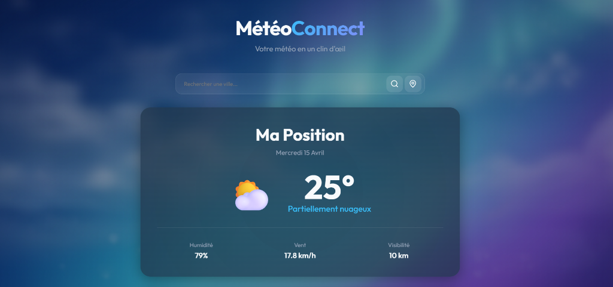

# 🌦️ MétéoConnect | Premium Weather Experience

MétéoConnect est une application météorologique moderne et immersive conçue avec **React 19** et **Vite**. Elle offre des prévisions précises grâce à l'intégration de l'API Open-Meteo, le tout enveloppé dans une interface utilisateur élégante et performante.



## 🚀 Fonctionnalités principales

- **🔍 Recherche Intelligente** : Auto-complétion des villes en temps réel avec détails géographiques.
- **📍 Géolocalisation** : Détectez instantanément la météo de votre position actuelle en un clic.
- **🌡️ Conditions en Temps Réel** : Affichage précis de la température, de l'humidité, du vent et de la visibilité.
- **📈 Graphiques Interactifs** : Visualisation de la tendance thermique sur les prochaines 24 heures via des graphiques SVG personnalisés.
- **📅 Prévisions Détaillées** :
    - **Horaires** : Aperçu heure par heure pour les prochaines 24 heures.
    - **Journalières** : Prévisions complètes sur 7 jours.
- **🎨 Design Ultra-Premium** : Esthétique glassmorphic, arrière-plans dynamiques et micro-animations fluides.

## 🛠️ Stack Technique

- **Frontend** : [React.js](https://react.dev/)
- **Build Tool** : [Vite](https://vitejs.dev/)
- **Styling** : Vanilla CSS 3 (Custom Design System)
- **API** : [Open-Meteo](https://open-meteo.com/) (Forecast & Geocoding)
- **Icons** : Unicode/SVG customisé

## 📦 Installation

Suivez ces étapes pour lancer le projet localement :

1.  **Cloner le dépôt** :
    ```bash
    git clone https://github.com/ELMehdi877/meteo.git
    cd meteo
    ```

2.  **Installer les dépendances** :
    ```bash
    npm install
    ```

3.  **Lancer le serveur de développement** :
    ```bash
    npm run dev
    ```

4.  **Accéder à l'application** : Ouvrez votre navigateur sur `http://localhost:5173` (ou le port indiqué dans votre terminal).

## 📁 Structure du Projet

```text
src/
├── components/          # Composants UI réutilisables
│   ├── CurrentWeather   # Carte météo principale
│   ├── TemperatureChart # Visualisation graphique
│   ├── HourlyForecast   # Carrousel horaire
│   ├── DailyForecast    # Liste journalière
│   └── SearchBox        # Barre de recherche & autocomplete
├── assets/              # Ressources statiques
├── utils.js             # Logique utilitaire & mapping WMO
├── App.jsx              # Orchestrateur principal
└── index.css            # Design System & thèmes
```

## 🤝 Contribution

Les contributions, issues et demandes de fonctionnalités sont les bienvenues ! N'hésitez pas à consulter la page des issues.
